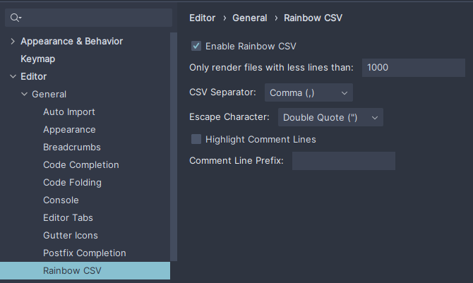

# Intellij Rainbow CSV

Plugin for highlighting CSV files in different colors for IntelliJ based IDEs.

## Screenshots

## Features

* Supports comma, semicolon, pipe, tab and colon as a delimiter
* Supports double quote and backslash as an escape character
* Supports custom column colors
* Supports a custom comment line prefix

## Install

<kbd>Preferences</kbd> > <kbd>Plugins</kbd> > <kbd>Marketplace</kbd> > <kbd>Search for "Rainbow CSV"</kbd> > <kbd>Install Plugin</kbd>  > <kbd>Restart IntelliJ IDEA</kbd>

## Support Us

You can support us by:

* Share this plugin with your friends/colleagues
* Star this project on GitHub
* Rate this plugin on [JetBrains plugin repository](https://plugins.jetbrains.com/plugin/12896-rainbow-csv)
* Tell us your ideas
* Make pull requests
* Report bugs
